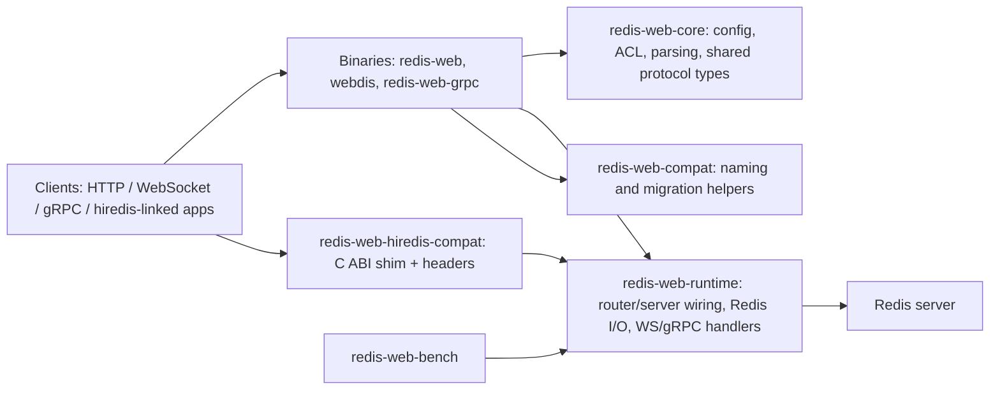

# Project Overview
`redis-web` is a Rust workspace that exposes Redis through HTTP, WebSocket, gRPC,
and a staged hiredis-compatible bridge. The repo is organized to keep config and
protocol logic stable in shared crates, keep the default server path lean, and
leave heavier compatibility, benchmarking, and docs surfaces as explicit opt-ins.

## Repository Structure
- `.github/` - GitHub Actions workflows for CI, releases, image publishing, and docs deploys.
- `crates/` - Rust workspace crates for core logic, runtime wiring, CLI binaries, compat, and benchmarks.
- `docker/` - Dockerfile plus compose stacks for dev, prod, SSL, RDB import, and external Redis scenarios.
- `docs/` - Astro/Starlight documentation site, examples, plans, and docs helper scripts.
- `scripts/` - Shell helpers for local startup, smoke tests, cert generation, imports, and image validation.
- `subprojects/` - External integration harnesses, including the redis-py hiredis compatibility workflow.
- `todos/` - File-based engineering todos and investigation notes.

Root manifests and config worth checking first:
- `Cargo.toml` - workspace membership and default members.
- `Makefile` - canonical build, test, perf, compat, and local CI commands.
- `README.md` - quick start, crate responsibilities, and doc pointers.
- `redis-web.json`, `redis-web.min.json`, `redis-web.prod.json` - canonical config samples.
- `redis-web.schema.json` - JSON schema for canonical config validation.
- `webdis.schema.json` - legacy compatibility schema during the rename transition.
- `prek.toml` - local pre-commit and pre-push hook definitions.

## Build & Development Commands
Install and bootstrap:

> TODO: There is no single bootstrap script for local machine setup.
> Install a stable Rust toolchain, Redis, OpenSSL headers, Docker, and Bun as needed.

```bash
cargo build --release
cd docs && bun install --frozen-lockfile
```

Build and type-check:

```bash
make build
cargo check --workspace --all-targets
cargo build --workspace
cd docs && bun run check
```

Lint and formatting:

```bash
cargo fmt --all -- --check
cargo clippy --workspace --all-targets --all-features -- -D warnings
cd docs && bun run check-links
```

Test:

```bash
make test
make test_all
make test_integration
make test_grpc
make test_compat
make perftest
cargo test --test config_test
cargo test --test integration_process_boot_test
./scripts/compose-smoke.sh
```

Run and debug:

```bash
cargo run -p redis-web --bin redis-web -- redis-web.min.json
cargo run -p redis-web --release --bin redis-web -- redis-web.json
cargo run -p redis-web --bin redis-web-grpc -- docs/examples/config/redis-web.grpc.json
cargo run -p redis-web -- --write-default-config --config ./redis-web.generated.json
./scripts/start-redis-web.sh --mode dev
./scripts/start-redis-web.sh --mode run --tag redis-web:dev --config redis-web.json
./scripts/generate-certs.sh
./scripts/import-rdb.sh /absolute/path/to/dump.rdb
```

Deploy and release-oriented commands:

```bash
docker compose -f docker/docker-compose.prod.yml up -d
./scripts/validate-image.sh --image ghcr.io/elicore/redis-web:latest --method cosign
make ci_local
```

## Code Style & Conventions
- Use Rust 2021 edition conventions across workspace crates.
- Format Rust with `cargo fmt --all`; CI and hooks also expect `cargo check` and `clippy` clean runs.
- Treat `clippy` warnings as errors when preparing changes for push.
- Follow existing naming patterns: crates use kebab-case, Rust modules/functions use snake_case,
  types/traits use CamelCase, and constants use SCREAMING_SNAKE_CASE.
- Keep test filenames explicit and behavior-oriented, following the existing `*_test.rs` pattern.
- Keep canonical naming on new surfaces: prefer `redis-web` over `webdis`, but preserve
  compatibility aliases where the repo already supports them.
- When changing config behavior, update `redis-web.schema.json` and the sample configs together.
- Local hooks live in `prek.toml`; install them with
  `prek install --hook-type pre-commit --hook-type pre-push`.
- Commit messages should follow the conventional-commit shape used by changelog tooling:
  `type(scope): short summary`
- Preferred commit types are `feat`, `fix`, `perf`, `refactor`, `docs`, `test`, and `chore`.

## Architecture Notes


`redis-web-core` owns stable shared concerns such as config loading, env expansion,
ACL handling, and request parsing. `redis-web-runtime` builds the actual service
surface for HTTP, WebSocket, Redis connectivity, and gRPC. The `redis-web` crate
is the application entrypoint and exposes the canonical `redis-web` binary, the
temporary `webdis` alias, and the separate `redis-web-grpc` binary. Compatibility
helpers in `redis-web-compat` keep file names and invocation behavior aligned during
the rename transition, while `redis-web-hiredis-compat` and `/__compat/*` routes
support hiredis-style integrations without forcing that weight onto the default path.

## Testing Strategy
- Unit tests: run `cargo test --workspace --lib` for crate-level behavior.
- Functional tests: use `make test` or `make test_functional` for fast config and
  contract coverage in `crates/redis-web/tests`.
- Integration tests: use `make test_integration` for Redis-backed process, HTTP,
  socket, and WebSocket flows.
- gRPC tests: use `make test_grpc` for gRPC contract and integration coverage.
- Compatibility tests: use `make test_compat` plus the compat-specific Make targets
  when changing hiredis bridge code.
- Smoke/e2e: use `./scripts/compose-smoke.sh` to validate the Docker dev stack.
- Performance: use `make perftest` and `make bench_config_compare SPEC=...` for
  larger regressions and config comparisons.

Local workflow:
1. Build first with `cargo build --release` or `make build`.
2. Run fast tests with `make test`.
3. Run integration layers only when local Redis and ports are available.
4. Run opt-in gRPC, compat, smoke, or perf workflows only when those surfaces changed.

CI workflow:
1. Pull requests run a sanity build and the Rust unit/functional/compat suite on Ubuntu.
2. Pushes, schedules, and opted-in workflow_dispatch runs execute broader Linux and macOS
   matrices, with Redis-backed integration coverage on Linux.
3. Docs changes trigger the Astro Pages build in `docs/`.

> TODO: There is no separate browser UI e2e suite because this repository is a service,
> not a frontend application.

## Security & Compliance
- Never commit real credentials into JSON config files; samples may show placeholders such as
  `http_basic_auth`, but production secrets should come from your runtime environment.
- Config supports exact `$VARNAME` expansion, so prefer environment-injected values for host,
  port, and credential-like settings.
- Security controls documented in the repo include ACL allow/deny rules, optional HTTP basic
  auth within ACL rules, Redis TLS settings, and a non-root container runtime user.
- For production images, prefer pinned GHCR tags and verify signatures with
  `./scripts/validate-image.sh --image ghcr.io/elicore/redis-web:latest --method cosign`.
- GitHub Actions use `GITHUB_TOKEN`, `COSIGN_KEY`, and `COSIGN_PASSWORD`; keep these in GitHub
  Secrets and never mirror them into tracked files.
- The docs site has build and link validation, but there is no dedicated dependency-audit or
  SAST workflow checked into `.github/workflows/`.
- Vendored hiredis sources and headers live under `crates/redis-web-hiredis-compat/`; any
  license review for redistribution should include that subtree.
- `CHANGELOG.md` generation and releases are automated, but the repository does not currently
  include a top-level `LICENSE` file.

> TODO: Add a documented dependency-scanning policy if cargo or npm audit becomes required.
> TODO: Add a top-level license file or an explicit licensing policy for the workspace.

## Agent Guardrails
- Do not edit `docs/dist/`, `docs/.astro/`, `target/`, `redis-web.log`, or `webdis.log`
  unless the task is explicitly about generated output or captured logs.
- Treat `crates/redis-web-hiredis-compat/vendor/` and `crates/redis-web-hiredis-compat/include/`
  as vendored/parity-sensitive surfaces; only change them for explicit compatibility work.
- Keep changes minimal and scoped; if you touch config semantics, also update schema, examples,
  and the relevant docs in the same change.
- Prefer fast validation first: `make test` before `make test_integration`, and do not run
  `make perftest` or compat matrix jobs in a tight loop.
- Require human review for changes to release workflows, Docker publishing, signing, ACL logic,
  TLS behavior, or hiredis ABI compatibility.
- Do not replace canonical `redis-web` naming with `webdis` in new code or docs, except where
  the repository intentionally preserves compatibility aliases.

## Extensibility Hooks
- `redis-web-runtime` exposes router-building APIs for embedding into another Axum service.
  Start with `server::build_router(&cfg)` and use `build_router_with_dependencies(...)`
  when you need custom clients, metrics, or authorization wrappers.
- `transport_mode` selects the active surface: `rest` for HTTP/WebSocket/compat or `grpc`
  for the dedicated `redis-web-grpc` binary.
- The `grpc` config block controls bind host/port, health, reflection, and message-size limits.
- The `compat_hiredis` config block enables the hiredis session bridge and sets prefix, TTL,
  session count, and pipeline limits.
- Exact `$VARNAME` strings in config files expand from the environment at load time.
- `REDIS_WEB_COMPAT_MUTE_HTTP_PUBSUB_WARNING=1` suppresses the one-time compat pub/sub warning.
- `REDIS_WEB_HIREDIS_SRC_DIR` overrides the hiredis source directory for the compat build.
- `OPENSSL_DIR`, `OPENSSL_INCLUDE_DIR`, and `OPENSSL_LIB_DIR` are respected by the hiredis
  compat build helpers when OpenSSL is not discoverable via `pkg-config`.
- Helper scripts expose a few operator hooks such as `CONFIG` in `start-redis-web.sh` and
  `HOST` / `PORT` in the hiredis benchmark workflow.

> TODO: No Cargo feature-flag matrix is documented in this repository today.

## Further Reading
- [`README.md`](README.md)
- [`docs/src/content/docs/maintainers/architecture.md`](docs/src/content/docs/maintainers/architecture.md)
- [`docs/src/content/docs/reference/api.md`](docs/src/content/docs/reference/api.md)
- [`docs/src/content/docs/reference/configuration.md`](docs/src/content/docs/reference/configuration.md)
- [`docs/src/content/docs/reference/cli.md`](docs/src/content/docs/reference/cli.md)
- [`docs/src/content/docs/guides/deployment.md`](docs/src/content/docs/guides/deployment.md)
- [`docs/src/content/docs/guides/embedding.md`](docs/src/content/docs/guides/embedding.md)
- [`docs/src/content/docs/guides/grpc-development.md`](docs/src/content/docs/guides/grpc-development.md)
- [`docs/src/content/docs/compatibility/hiredis-dropin.md`](docs/src/content/docs/compatibility/hiredis-dropin.md)
- [`docs/src/content/docs/compatibility/hiredis-client-integration.md`](docs/src/content/docs/compatibility/hiredis-client-integration.md)
- [`docs/src/content/docs/maintainers/benchmark-catalog.md`](docs/src/content/docs/maintainers/benchmark-catalog.md)
- [`crates/redis-web/tests/README.md`](crates/redis-web/tests/README.md)
