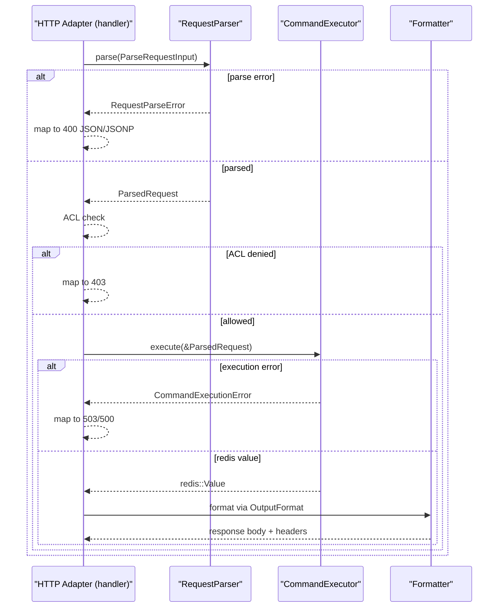

# Interface Reference

This document explains the embedding interfaces in detail: where they connect, what each field means, and how to extend them safely.

## Design intent

The embedding boundary separates concerns into four layers:

1. Transport adapter (`handler` + `server`) extracts HTTP/WebSocket input.
2. Parser (`RequestParser`) normalizes input into `ParsedRequest`.
3. Executor (`CommandExecutor`) runs commands against Redis or another backend.
4. Formatter (`handler` + `format`) maps execution results to HTTP responses.

This split keeps protocol-specific behavior (HTTP headers, URI parsing, CORS, ETag) outside backend execution.

## Architecture overview


## Connection points in code

- Interface traits and shared input type: `src/interfaces.rs`
- Normalized request model and default parser: `src/request.rs`
- Default Redis executor: `src/executor.rs`
- Wiring and dependency injection: `src/server.rs`
- HTTP adapter that calls parser/executor: `src/handler.rs`

When embedding, almost all customization should happen by replacing parser and executor in `ServerDependencies`.

## `RequestParser`

Source: `src/interfaces.rs`

```rust
pub trait RequestParser: Send + Sync {
    fn parse(&self, input: ParseRequestInput<'_>) -> Result<ParsedRequest, RequestParseError>;
}
```

### Responsibilities

- Parse command path and query params into a canonical `ParsedRequest`.
- Resolve default and explicit DB routing.
- Decide output format and content-type hints.
- Preserve body bytes for command execution.

### Non-responsibilities

- No Redis access.
- No ACL decisions.
- No HTTP response generation.

### Input contract (`ParseRequestInput`)

- `command_path`: path without leading slash, still in transport string form.
- `params`: query parameter map for JSONP and `?type=...` behavior.
- `default_database`: DB used when no explicit DB prefix exists.
- `body`: optional request body bytes; parser may append as `body_arg`.
- `etag_enabled`: hint used by downstream response path (typically true for GET-like paths).

### Output contract (`ParsedRequest`)

The parser must return a fully executable request:

- Command identity: `command_name`.
- Command arguments: `args`, plus optional binary `body_arg`.
- Routing: `target_database`.
- Output behavior: `output_format`, `jsonp_callback`, content-type hints.
- Cache semantics hint: `etag_enabled`.

### Error contract (`RequestParseError`)

- `EmptyCommand`: no command segment found.
- `InvalidDatabaseIndex`: numeric DB prefix not valid for `u8`.
- `MissingCommandAfterDatabasePrefix`: path like `/7/`.
- `InvalidCommand(String)`: policy or shape validation from custom parser logic.

`handler` maps parser errors to HTTP `400`.

## `CommandExecutor`

Source: `src/interfaces.rs`

```rust
pub trait CommandExecutor: Send + Sync {
    fn execute<'a>(&'a self, request: &'a ParsedRequest) -> ExecutionFuture<'a>;
}
```

### Responsibilities

- Run parsed command against backend.
- Return `redis::Value` to keep formatter behavior consistent.
- Classify failures into availability vs execution errors.

### Non-responsibilities

- No request parsing or URL policy checks.
- No ACL checks.
- No HTTP status/header construction.

### Error contract (`CommandExecutionError`)

- `ServiceUnavailable(String)`: dependency unavailable, pool acquisition failed, upstream timeout.
- `ExecutionFailed(String)`: command failed after dependency was available.

`handler` maps:

- `ServiceUnavailable` -> `503 Service Unavailable`
- `ExecutionFailed` -> `500 Internal Server Error`

## `ParsedRequest` field guide

Source: `src/request.rs`

- `target_database`: final DB index executor should use.
- `command_name`: Redis command verb; preserve case-insensitive semantics if policy compares names.
- `args`: textual args parsed from path segments.
- `body_arg`: raw bytes appended by POST/PUT-style requests.
- `output_format`: one of `Json`, `Raw`, `MessagePack`, `Text`.
- `jsonp_callback`: callback name for JSON output only.
- `content_type_override`: explicit `?type=` MIME override.
- `extension_content_type`: MIME inferred from URI extension.
- `etag_enabled`: whether response layer should evaluate conditional cache behavior.

## Request lifecycle



## Default implementations and behavior

- Parser: `webdis::request::WebdisRequestParser`
- Executor: `webdis::executor::RedisCommandExecutor`
- Wiring helper: `webdis::server::build_router(&config)`

This default stack preserves existing behavior (DB prefix parsing, format suffixes, JSONP, ETag generation, and ACL checks).

## Dependency injection path

When custom behavior is needed:

1. Build dependencies in your host app.
2. Provide `ServerDependencies { request_parser, command_executor }`.
3. Call `build_router_with_dependencies`.

This is the only supported extension path needed for most embedding scenarios.

## Maintainer guidance

- Add new parser fields only if both parser and handler consume them.
- Keep parser deterministic and side-effect free.
- Keep executor transport-agnostic; do not import Axum types.
- Prefer `InvalidCommand(String)` for custom policy parser failures.
- Preserve backward compatibility in `RequestParseError` and `CommandExecutionError` mappings unless intentionally changing public behavior.
